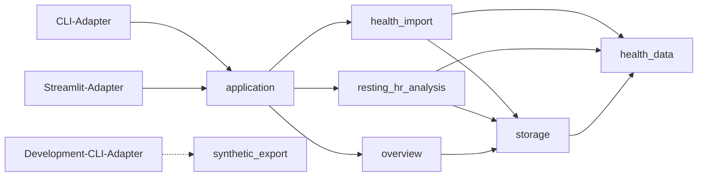

# Persönliche Gesundheitsanalyseplattform

## Projektvision, Zielarchitektur und MVP-Plan

> **Status:** V0.1-Akzeptanzumfang implementiert und durch den dokumentierten Ablauf nachgewiesen
> **Primäre Plattform im MVP:** macOS / lokaler Browser  
> **Analytischer Kern:** Python  
> **Langfristige Apple-Integration:** Swift, SwiftUI und HealthKit  
> **Zielgruppe im MVP:** persönliche Nutzung und technisches Lernprojekt

---

Begleitdokumente:

- [Fachglossar](./CONTEXT.md)
- [Technisches und betriebliches Glossar](./docs/TECHNICAL_GLOSSARY.md)
- [Architekturentscheidungen](./docs/adr/)

---

## Inhaltsverzeichnis

1. [Projektziel](#projektziel)
2. [Zielbild](#zielbild)
3. [Technische Rahmenbedingungen](#technische-rahmenbedingungen)
4. [Empfohlene Zielarchitektur](#empfohlene-zielarchitektur)
5. [Benutzeroberfläche](#benutzeroberfläche)
6. [Speicherarchitektur](#speicherarchitektur)
7. [Datenmodell](#datenmodell)
8. [Importpipeline](#importpipeline)
9. [Analytische Ebenen](#analytische-ebenen)
10. [Erklärbarkeit](#erklärbarkeit)
11. [Reproduzierbarkeit](#reproduzierbarkeit)
12. [Automatisierung und Scheduler](#automatisierung-und-scheduler)
13. [Swift- und HealthKit-Module](#swift--und-healthkit-module)
14. [Synchronisation und Cloud-Strategie](#synchronisation-und-cloud-strategie)
15. [Ärzteberichte](#ärzteberichte)
16. [MVP-Umfang](#mvp-umfang)
17. [Entwicklungsphasen](#entwicklungsphasen)
18. [Technologieauswahl](#technologieauswahl)
19. [Empfohlene Reihenfolge](#empfohlene-reihenfolge)
20. [Quellen](#quellen)

---

## Projektziel

Ziel des Projekts ist die Entwicklung einer persönlichen Gesundheitsanalyseplattform, die Gesundheits-, Fitness-, Ernährungs- und Kontextdaten langfristig zusammenführt, statistisch analysiert und wissenschaftlich nachvollziehbar visualisiert.

Die Anwendung soll zunächst als lokales, browserbasiertes System auf einem MacBook Pro laufen. Der analytische Kern wird in Python umgesetzt. Swift und SwiftUI sollen schrittweise ergänzt werden, insbesondere für eine spätere direkte Integration mit HealthKit auf iPhone oder iPad.

Das Projekt dient gleichzeitig als:

- persönliches Gesundheitsjournal,
- wissenschaftliches Analysewerkzeug,
- Plattform für fortgeschrittene statistische Modellierung,
- Lernprojekt für Swift, SwiftUI und Apple-Plattformen,
- Grundlage für spätere Automatisierung und Geräteintegration.

---

## Zielbild

Die Plattform soll langfristig:

- Apple-Health-Daten und weitere Gesundheitsdaten importieren,
- Rohdaten unverändert archivieren,
- neue Daten inkrementell ergänzen,
- Datenquellen und Geräte nachvollziehbar speichern,
- manuelle Einträge ermöglichen,
- Laborwerte strukturiert erfassen,
- Datenqualität, Duplikate und Konflikte prüfen,
- deskriptive, assoziative, prognostische und kausal orientierte Analysen unterscheiden,
- komplexe statistische Modelle ausführen,
- Ergebnisse mit Unsicherheiten und Annahmen erklären,
- Tages-, Wochen- und Ärzteberichte erzeugen,
- Modellläufe und Datensätze reproduzierbar versionieren,
- später automatisch über HealthKit mit neuen Daten versorgt werden.

### Vereinfachter langfristiger Datenfluss

```text
Apple Watch
    │
    ▼
iPhone / iPad mit HealthKit
    │
    │ Export oder Synchronisation
    ▼
Gemeinsamer Datenspeicher
    │
    ▼
Python-Analyseplattform auf dem Mac
    │
    ├── Dashboard
    ├── statistische Modelle
    ├── Berichte
    └── Datenexporte
```

Im ersten Prototyp ersetzt ein manueller Apple-Health-Export das mobile HealthKit-Modul.

---

## Technische Rahmenbedingungen

HealthKit stellt ein zentrales Repository für Gesundheits- und Fitnessdaten auf unterstützten Apple-Geräten bereit. Apps benötigen eine granulare Berechtigung für die einzelnen Datentypen, die sie lesen oder schreiben möchten.

Für dieses Projekt ist entscheidend:

- Der produktive Zugriff auf HealthKit-Daten erfolgt über eine App auf einem unterstützten Gerät wie iPhone oder iPad.
- Der Mac dient zunächst als Analyseplattform.
- Der erste Prototyp arbeitet mit synthetischen Daten und später mit manuellen Exporten.
- Eine Swift-/HealthKit-Bridge wird erst ergänzt, nachdem der analytische Kern stabil ist.
- Die statistische Logik soll unabhängig von SwiftUI, Streamlit oder einer anderen Oberfläche implementiert werden.
- Logs im realen Datenmodus enthalten standardmäßig keine Gesundheitswerte, Medikamentennamen oder personenbezogenen Dateipfade; ausführliche Diagnosen benötigen eine bewusste Freigabe.

---

## Empfohlene Zielarchitektur

Der Python-Kern sollte unabhängig von der Benutzeroberfläche aufgebaut werden.

```text
personal-health-lab/
├── src/
│   └── personal_health_lab/
│       ├── application/
│       ├── health_data/
│       ├── health_import/
│       ├── resting_hr_analysis/
│       ├── storage/
│       ├── overview/
│       ├── synthetic_export/
│       └── adapters/
│           ├── cli/
│           └── streamlit/
├── tests/
│   ├── acceptance/
│   ├── internal/
│   ├── adapters/
│   └── fixtures/
├── docs/
│   └── adr/
├── pyproject.toml
└── README.md
```

Die Struktur folgt tiefen Modulen an fachlich relevanten Seams statt horizontalen Technikschichten. Importvalidierung bleibt im `health_import`-Modul; Regularisierung, Bootstrap und Diagnostik bleiben im `resting_hr_analysis`-Modul. Das `health_data`-Modul besitzt die von Import, Speicherung und Analyse gemeinsam verwendeten kanonischen Werttypen und Invarianten, aber keine Import- oder Persistenzlogik.



Produktionsadapter hängen vom Anwendungsmodul ab, niemals umgekehrt. Der Development-CLI-Adapter darf zusätzlich `synthetic_export` verwenden. `health_data` hängt von keinem anderen Projektmodul ab. `storage` kennt kanonische Typen, aber keine Analyse- oder UI-Logik. Das reale Anwendungsmodul bleibt von `synthetic_export` unabhängig. Neue Abhängigkeiten dürfen keinen Zyklus erzeugen.

Ein automatischer Architekturtest prüft diese Regeln und lehnt verbotene Modulimporte sowie Abhängigkeitszyklen ab.

Jedes Modul veröffentlicht sein Interface ausschließlich über sein `__init__.py`. Modulübergreifende Deep Imports in Implementierungsdateien sind verboten; nur gezielte interne Tests dürfen interne Seams direkt verwenden.

Modul-Interfaces verwenden unveränderliche, typisierte Wertobjekte, Receipts und Snapshot-Referenzen. Frei strukturierte Dictionaries, Pandas-/Polars-DataFrames, Arrow-Tabellen und SQL-Zeilen bleiben innerhalb des besitzenden Moduls. `Overview` enthält explizit typisierte Serien und Status.

Identitäten wie `ImportId`, `SnapshotId`, `AnalysisRunId` und `LogicalMeasurementId` sind getrennte opake Typen und nicht als beliebige Strings austauschbar. Ihre UUID-, Hash- oder Serialisierungsdarstellung bleibt Implementierungsdetail.

Alle öffentlichen Modulexporte sind vollständig typisiert. `mypy` läuft mindestens für Interfaces und `health_data` im strikten Modus; implizites `Any` ist an Seams verboten. Extern eingelesene Konfigurationen und JSON-Strukturen werden zusätzlich zur statischen Typprüfung zur Laufzeit validiert.

### Architekturprinzipien

1. **Trennung von Oberfläche und Analyse**

   Die UI enthält keine komplexe statistische Logik. Sie ruft klar definierte Modul-Interfaces auf.

2. **Unveränderliche Rohdaten**

   Importierte Originaldaten werden archiviert und nicht überschrieben.

3. **Inkrementelle Verarbeitung**

   Bereits importierte Datensätze werden erkannt. Neue Daten werden ergänzt, statt alles erneut aufzubauen.

4. **Reproduzierbare Analysen**

   Jeder Modelllauf verweist auf eine Datensatzversion, Modellversion und Konfiguration.

5. **Seams nur bei realer Variation**

   CLI und Streamlit rechtfertigen eine gemeinsame Anwendungs-Seam. Weitere Seams entstehen erst bei mindestens zwei realen Adaptern; V0.1 abstrahiert den lokalen Speicher nicht hypothetisch.

### V0.1-Modularchitektur

CLI und Streamlit sind zwei Adapter an derselben Anwendungs-Seam. Sie verwenden dasselbe Interface und enthalten keine Import-, Speicher-, Datenqualitäts- oder Analyselogik. Das CLI stellt zuerst den vollständig reproduzierbaren Ablauf bereit; Streamlit ergänzt anschließend die interaktive Darstellung.

Das externe V0.1-Interface bleibt auf drei Operationen begrenzt:

```python
with HealthLab.open(runtime_config) as app:
    import_receipt = app.import_health_export(package_path)
    analysis_receipt = app.run_resting_hr_analysis(config)
    overview = app.load_overview(selection)

# Interface:
# import_health_export(package_path: Path) -> ImportReceipt
# run_resting_hr_analysis(config: RestingHeartRateAnalysisConfig) -> AnalysisReceipt
# load_overview(selection: OverviewSelection) -> Overview
```

Receipts enthalten stabile IDs, Status und Diagnosen, aber keine Parquet-, SQLite-, DuckDB- oder Staging-Details. Parser, Importtransaktion, Speicherung, Tagesaggregation und Modellierung bleiben interne Module beziehungsweise interne Seams. CLI, Streamlit und End-to-End-Tests verwenden ausschließlich dieses externe Interface.

| Receipt | Pflichtinhalt |
|---|---|
| `ImportReceipt` | `operation_id`, `import_id`, Status, Paket-Hash, optionale `SnapshotRef`, Datensatzzähler, Anzahl Auffälligkeiten und datensparsame Diagnosen |
| `AnalysisReceipt` | `operation_id`, `analysis_run_id`, Status, `SnapshotRef`, `analysis_definition_id`, Modellreifestatus, optionale Ergebnisreferenz und datensparsame Diagnosen |

Receipts enthalten keine einzelnen Gesundheitswerte. Detaildaten werden über `Overview` beziehungsweise spätere dedizierte Leseoperationen geladen.

`ImportReceipt.status` ist eine geschlossene Menge:

- `committed`: neuer Snapshot veröffentlicht,
- `duplicate`: identisches Paket bereits erfolgreich verarbeitet,
- `rejected`: kein lesbares oder unterstütztes Health-Exportpaket; Eingabedaten werden nicht behalten,
- `quarantined`: erkanntes Health-Exportpaket mit fehlgeschlagener Verarbeitung oder Validierung; Diagnose bleibt erhalten,
- `store_busy`: ein anderer Schreiber hält den Datenspeicher.

`AnalysisReceipt.status` ist ebenfalls geschlossen:

- `completed`: neuer Modelllauf gespeichert,
- `reused`: identische Kombination aus Snapshot-, Konfigurations-, Analysedefinitions-, Code-Commit- und Environment-Lock-Hash bereits erfolgreich berechnet,
- `insufficient_data`: das Modell kann nicht sinnvoll gefittet werden,
- `unstable`: Fit oder Diagnostik ist datenbedingt instabil; Diagnose bleibt erhalten,
- `store_busy`: das Ergebnis konnte wegen eines konkurrierenden Schreibers nicht gespeichert werden.

Bei `completed` unterscheidet der separate Modellreifestatus weiterhin `exploratory` und `robust`.

`runtime_config` bindet Datenmodus und Datenspeicher beim Öffnen des Anwendungsmoduls. Beide bleiben für dessen Lebensdauer unveränderlich und werden nicht erneut an einzelne Operationen übergeben.

`HealthLab` ist ein Context Manager mit deterministischem Ressourcen-Cleanup. Es gibt keinen globalen Singleton; CLI, Streamlit und Tests öffnen und schließen eine Instanz explizit.

Nur der Composition Root des jeweiligen Adapters liest CLI-Argumente, Umgebungsvariablen oder Konfigurationsdateien und validiert daraus `runtime_config`. Interne Module erhalten unveränderliche Werte und Abhängigkeiten; sie lesen weder `os.environ` noch globale Settings.

Die Konfigurationspriorität lautet: explizite Adapterauswahl, Umgebungsvariable, lokale Konfigurationsdatei, versionierter Standardwert. Maschinenlesbare CLI-Ausgaben weisen die wirksame, datensparsam redigierte Laufzeitkonfiguration aus.

Erwartbare Ergebnisse wie `duplicate`, `quarantined` oder `model_not_ready` werden als typisierte Receipt-Status zurückgegeben. Unerwartete technische Defekte wie ein nicht lesbarer Datenspeicher verlassen das Modul als kleine Menge typisierter Ausnahmen. CLI und Streamlit übersetzen dieselben Status und Ausnahmen in ihre jeweilige Darstellung.

Öffentliche Receipt-Status und Ausnahmen gehören dem `application`-Modul. Interne Module besitzen lokale Fehlerdetails, die dort genau einmal übersetzt werden; Adapter importieren keine Fehlerklassen aus `storage`, `health_import` oder `resting_hr_analysis`.

Die drei V0.1-Operationen laufen synchron. Laufzeit und Fortschrittsbedarf werden gemessen; eine Job- oder Async-Seam wird erst eingeführt, wenn der reale Datenpilot lange Operationen belegt.

Das interne Speichermodul verwendet in Produktion und Tests dieselbe SQLite-, Parquet- und DuckDB-Implementierung; Tests stellen lediglich temporäre Verzeichnisse bereit. V0.1 führt keine öffentlichen Repository-Interfaces oder In-Memory-Fakes pro Tabelle ein. Eine zusätzliche Speicher-Seam entsteht erst, wenn tatsächlich ein zweiter Adapter benötigt wird.

Sein internes Interface ist absichtsorientiert, beispielsweise `publish_import`, `open_analysis_snapshot`, `save_analysis_run` und `load_overview_data`. Tabellen-CRUD, generische Repositories, SQL-Zeilen und Dateipfade sind keine Interface-Bestandteile.

Das externe Anwendungs-Interface ist die primäre Testoberfläche. End-to-End-Tests öffnen `HealthLab` mit einem temporären Datenspeicher und verwenden dieselben drei Operationen wie CLI und Streamlit. Interne Tests sind auf anspruchsvolle reine Algorithmen wie Zeitgrenzen, Messidentität und Bootstrap begrenzt; Adaptertests prüfen ausschließlich Formatierung und Interaktion.

Das Importmodul ist ein tiefes internes Modul. Es verbirgt XML-Streaming, Typfilterung, Normalisierung, Deduplizierung, Quellversionierung, Staging, Validierung, atomare Veröffentlichung und Quarantäne hinter einer einzelnen Importoperation. Pipeline-Schritte sind interne Seams und keine von Aufrufern zu orchestrierenden öffentlichen Module.

Aufrufer übergeben dem Importmodul ausschließlich einen lokalen Pfad. Lesbarkeit, ZIP-Struktur, XML-Inhalt, Formatversion und Positivliste werden im Modul geprüft; ungültige Benutzerpakete erscheinen als erwartbarer Receipt-Status.

Jedes Paket gilt als nicht vertrauenswürdige Eingabe. Das Importmodul verhindert ZIP-Pfadtraversal, begrenzt komprimierte und entpackte Größen sowie Eintragszahlen, erlaubt nur erwartete Eintragstypen, deaktiviert XML-External-Entities und Netzwerkzugriffe und schreibt ausschließlich in seinen Staging-Bereich.

Ein sicherheitsbezogener Abbruch liefert `rejected`, entfernt alle extrahierten Staging-Artefakte und speichert nur datensparsame Diagnosemetadaten. Die vom Benutzer ausgewählte Originaldatei wird niemals gelöscht oder verändert.

Das Ruhepulsanalysemodul ist ebenfalls tief. Es verbirgt Snapshot-Auflösung, Bildung der Tagesmerkmale, Modellreifeprüfung, regularisierten Distributed-Lag-Fit, Moving-Block-Bootstrap, Diagnostik und Ergebnispersistenz hinter `run_resting_hr_analysis(config)`. Statistische Teilschritte bleiben interne Seams.

Zu Beginn eines Analyseaufrufs löst das Modul genau eine aktuelle Snapshot-Referenz auf und pinnt sie für den gesamten Lauf. `AnalysisReceipt` und Run-Historie speichern diese Referenz; spätere Imports oder Korrekturen verändern den Lauf nicht.

Der synthetische Exportgenerator ist ein getrenntes Entwicklungsmodul mit `generate_export(scenario_id, seed, destination, *, options=None) -> GeneratedFixture`. Entwicklungs-CLI und Tests verwenden dieses Interface; das reale Anwendungsmodul und der reale Datenmodus können es nicht erreichen. Signalform sowie Algorithmen und Standardwerte für Rauschen, Missingness und Qualitätsfälle bleiben in versionierten Szenariodefinitionen verborgen. Explizite `GenerationOptions` dürfen für reproduzierbare Robustheits-Fixtures Rauschen und Missingness einer einzelnen Realisierung variieren; Szenario-ID, Seed und effektive Optionen werden gemeinsam gespeichert. V0.1 liefert mindestens `lag-signal-v1` und `null-v1`; Änderungen an Signalform, Algorithmen oder Standardwerten erzeugen neue Szenario-IDs.

Die CLI-Seam besitzt zwei getrennte Einstiegspunkte: `healthlab` für Import, Analyse und Overview sowie `healthlab-dev` ausschließlich für die Erzeugung synthetischer Fixtures. Der Production-CLI-Adapter kennt den Generator nicht; der Development-CLI-Adapter darf keinen realen Datenspeicher öffnen.

`healthlab` bietet menschenlesbare Standardausgabe und optional `--json` mit versioniertem Schema für Receipts und Overview. Dokumentierte Exitcodes unterscheiden erfolgreiche, erwartbar nicht abgeschlossene und technisch fehlgeschlagene Operationen.

Die Exitcode-Klassen sind: `0` für Erfolg oder idempotenten No-op, `2` für ungültige CLI-Verwendung, `3` für einen erwartbaren nicht abgeschlossenen Zustand und `1` für einen unerwarteten technischen Defekt. Der JSON-Body enthält stets den konkreten typisierten Status.

Jede V0.2-Schreiboperation verwendet unabhängig vom aktuellen Schutz- und Freigabestatus denselben zweistufigen Anwendungsvertrag: eine nebenwirkungsfreie typisierte Schreibvorschau und deren ausdrückliche Ausführung. Sämtliche fachlichen Eingaben sind vor der Vorschau festgelegt und im Plan-Fingerprint gebunden; Bearbeiten verwirft den Plan. Die menschenlesbare CLI zeigt Vorschau und Bestätigung innerhalb eines Aufrufs. Im JSON-Modus liefert der erste Aufruf den vollständigen Plan; der zweite wiederholt dieselben Argumente und führt nur bei neu berechnetem identischem Fingerprint aus. Angezeigte Pläne werden nicht persistiert.

Die öffentliche V0.2-Seam ersetzt die benannten schreibenden V0.1-Methoden durch genau zwei Methoden:

```python
with HealthLab.open(runtime_config) as app:
    plan = app.preview_write(request)
    receipt = app.execute_write(request, expected_plan=plan.fingerprint)

# Interface:
# preview_write(request: WriteRequest) -> WritePlan
# execute_write(
#     request: WriteRequest,
#     *,
#     expected_plan: PlanFingerprint,
# ) -> WriteReceipt
```

`WriteRequest` ist eine geschlossene Union aus `ImportHealthExport`, `RunRestingHeartRateAnalysis`, `ResolveDataReviewCase`, `ConfirmDataReviewBatch`, `RevokeDataReviewDecision`, `CreatePlausibilityRuleVersion`, `RunHistoricalReview`, `CreateMetadataBackup`, `BeginMetadataRestore`, `AbortMetadataRestore`, `MigrateStore` und `RollbackMigration`. Der Widerrufsauftrag adressiert typisiert entweder eine einzelne Entscheidungs-ID oder eine Sammelaktions-ID. `ResolveDataReviewCase.resolution` ist selbst eine geschlossene Union für Datenbestätigung, Datenkorrektur, lokalen Messungsausschluss, Quellwertübernahme, Quellenlöschungsentscheidung und Konfliktauflösung. Eine neue vollständige Plausibilitätsregelversion deckt Erstanlage, Änderung, Deaktivierung, Reaktivierung und die ausdrückliche Übernahme einer ausgelieferten Empfehlung ab.

`WritePlan` und `WriteReceipt` sind unveränderliche gemeinsame Hüllen. Operationsspezifische Plandetails und Ergebnisse bleiben geschlossene typisierte Unions statt öffentlicher Generics, Protocols oder Vererbungshierarchien. Der Plan enthält Fingerprint, `WriteApproval` mit `ready`, `confirmation_required` oder `blocked`, typisierte Bestätigungsgründe, Details und Diagnosen. Die ausdrückliche Ausführung des identischen Fingerprints bestätigt sämtliche Gründe gemeinsam; ein separates Bestätigungsargument gibt es nicht. Das Receipt enthält Operations-ID, Plan-Fingerprint, operationsspezifisches oder `WriteNotStarted`-Ergebnis, finalen Preflight und Diagnosen. `plan_changed`, `blocked` und `store_busy` sind typisierte nicht gestartete Ergebnisse; nur unerwartete technische Defekte verlassen die Seam als Ausnahme.

`ImportHealthExport` ist im Zustand `restore_pending` weiterhin derselbe öffentliche Auftrag, rekonstruiert intern aber ausschließlich die benötigten Quellenidentitäten. Sobald der letzte benötigte Export alle Referenzen schließt, aktiviert dieselbe Operation das bereits gemeinsam bestätigte Overlay atomar; ein zusätzlicher `CompleteRestore`-Auftrag existiert nicht. Sicherungsschema-Migrationen bleiben Bestandteil von `BeginMetadataRestore`, und einzelne Migrationsschritte werden nicht öffentlich. Bei synchroner Ausführung bedeutet Abbruch vor der Migration lediglich, nicht auszuführen; ein fehlgeschlagener erneuter Versuch beginnt über `MigrateStore` frisch.

Eine Sammelbestätigung macht Filter, Anzahl, stabile Fall-IDs und entscheidungsrelevante Werte der vollständigen materialisierten Treffermenge prüfbar. Streamlit darf dafür eine paginierte Tabelle und die CLI den nativen Pager verwenden; JSON enthält die vollständige Liste. Kein Adapter kürzt still oder rekonstruiert die Treffermenge selbst.

Streamlit verwendet `session_state` ausschließlich für flüchtige UI-Auswahl und Navigation. Import-, Prüf- und Analysezustände bleiben hinter dem Anwendungs-Interface persistent. Caches dürfen nur unveränderliche Leseprojektionsdaten halten und müssen die jeweils relevanten Snapshot-, Run-, Regel-, Audit- oder Sicherungs-IDs im Cache-Key führen.

V0.2-Schreibvorschauen erscheinen inline auf der jeweils zuständigen Fachseite. Ein Seitenwechsel verwirft sie; global bleibt nur ein schreibgeschützter Workspace-Status, keine Operationswarteschlange. `migration_required` fokussiert ausschließlich „Migration und Diagnose“, `restore_pending` ausschließlich „Sicherung und Wiederherstellung“; die übrigen Seitennamen bleiben zur Orientierung sichtbar, sind aber deaktiviert. Diese Navigation ist Präsentationslogik, während zulässige Operationen, Plan, Freigabestatus, Diagnosen und Ausführung vollständig aus dem gemeinsamen Anwendungs-Interface stammen.

`application` ist die einzige öffentliche Lese-Seam für CLI und Streamlit, veröffentlicht in V0.2 aber mehrere kleine benannte Projektionen statt eines anwachsenden Gesamt-`Overview` oder eines generischen Query-Bus:

```python
app.load_workspace_status() -> WorkspaceStatus
app.load_overview(selection) -> Overview | ProjectionUnavailable
app.load_data_review(selection) -> DataReview | ProjectionUnavailable
app.load_data_review_case(case_id) -> DataReviewCaseDetail | ProjectionUnavailable
app.load_plausibility_rules() -> PlausibilityRules | ProjectionUnavailable
app.load_recovery_status() -> RecoveryStatus | ProjectionUnavailable
app.load_migration_diagnostics() -> MigrationDiagnostics | ProjectionUnavailable
```

`HealthLab.open` verändert den Datenspeicher niemals und öffnet auch bei `migration_required`, `restore_pending` oder einem unbekannten neueren Schema eine eingeschränkte Sitzung, solange der Speicher noch sicher diagnostizierbar ist. `WorkspaceStatus` enthält Datenmodus, Datenspeicher-ID, Betriebszustand sowie die fachlich zulässigen Lese- und Schreiboperationen. Die Anwendung erzwingt diese Zulässigkeit zusätzlich; ein unzulässiger oder nicht vorhandener Lesezugriff liefert `ProjectionUnavailable` mit typisiertem Code und datensparsamer Diagnose statt einer erwartbaren Ausnahme. Beschädigte oder technisch nicht diagnostizierbare Speicher bleiben technische Fehler.

`load_overview(selection)` liefert ein präsentationsneutrales `Overview` mit Zeitreihen, Trends, Unsicherheit, Qualitäts- und Quellenstatus, Analyseverweisen, Methodik und Provenienz. `load_data_review` liefert die vollständige unveränderliche Trefferliste für seinen typisierten Filter; Streamlit paginiert nur visuell, während die CLI den nativen Pager verwendet. `ConfirmDataReviewBatch` verwendet denselben Filtertyp, materialisiert die exakte Menge erneut und bindet sie vollständig in den Plan-Fingerprint. Cursor, Storage-Paging und eine künstliche V0.2-Mengenobergrenze existieren nicht.

Projektionen liefern typisierte Werte, Begründungscodes und fachlich zulässige Aktionen, aber keine fertigen UI-Texte. Benutzertexte wie Notizen und Pflichtbegründungen bleiben Fachdatum. Produktionsadapter importieren sämtliche Requests, Pläne, Receipts, Projektionen, IDs, Enums und Ausnahmen ausschließlich über `personal_health_lab.application`; sie greifen niemals direkt auf Speicher- oder interne Lesemodule zu. Benutzerausgewählte Paket-, Sicherungs- und Zielpfade dürfen Eingaben sein, interne oder unredigierte Speicherpfade und konkrete SQLite-, Parquet-, DuckDB-, Staging- oder Tabellenformen erscheinen weder in Projektionen noch in Receipts.

Das interne `overview`-Modul verbirgt weiterhin Snapshot- und Ergebniswahl, Statusmarker, Zeitreihen-, Provenienz- und Methodikabfragen für `Overview`. Die interne Eigentümerschaft der weiteren Projektionen wird getrennt festgelegt und ist kein Grund, ihre Orchestrierung in Adapter zu verlagern.

`OverviewSelection` enthält ausschließlich den gewünschten Zeitraum beziehungsweise eines der festen Zeitfenster. Das Modul wählt aktuelle wirksame Analyseergebnisse selbst und liefert Qualitäts-, Quellen- und Provenienzstatus immer vollständig; rein visuelles Ein- und Ausblenden bleibt Sache des Adapters.

`Overview` zeigt immer das neueste Ergebnis. Ist es vorläufig oder veraltet, verweist das Ansichtsmodell zusätzlich auf das letzte nicht vorläufige Ergebnis; ein stilles Zurückfallen auf einen älteren Stand ist ausgeschlossen.

Ohne vorhandene Daten liefert `load_overview` ein gültiges `Overview` mit typisiertem Zustand `empty`; weitere erwartbare Zustände sind `ready` und `provisional`. Das bisherige freie `Overview.message` entfällt zugunsten typisierter Status- und Begründungscodes.

Analysekonfigurationen sind unveränderliche, typisierte und versionierte Objekte. Das externe Objekt enthält nur benutzerrelevante Angaben wie Zeitraum und `analysis_definition_id`. Lag-Fenster, Skalierung, Regularisierung, Bootstrap-Regel, Diagnostik und Seeds gehören zur versionierten internen Analysedefinition und werden in der Methodikansicht transparent dargestellt. Eine methodische Änderung erzeugt eine neue Analysedefinition statt einer stillen Parameteränderung.

### Beispiel einer Analyseschnittstelle

```python
from datetime import date

config = RestingHeartRateAnalysisConfig(
    analysis_definition_id=AnalysisDefinitionId("lag-signal-v1"),
    start_date=date(2025, 1, 1),
    end_date=date(2026, 1, 1),
)

request = RunRestingHeartRateAnalysis(config=config)
plan = app.preview_write(request)
receipt = app.execute_write(request, expected_plan=plan.fingerprint)
```

---

## Benutzeroberfläche

### Empfehlung für den MVP: Streamlit

Für den ersten Prototyp ist Streamlit besonders geeignet:

- vollständig in Python,
- schnelle Entwicklung,
- Multipage-Anwendungen,
- interaktive Filter,
- Buttons und Formulare,
- Integration mit Plotly, Altair, Pandas und Polars,
- lokale Ausführung über `localhost`,
- im realen Datenmodus des MVP ausschließlich über `localhost` erreichbar,
- Unterstützung für Session State und Caching.

Die Streamlit-Anwendung sollte als Präsentationsschicht dienen. Datenzugriff und Analysen werden in eigenständigen Python-Packages implementiert.

### Vorgeschlagene Seiten

1. Gesamtübersicht
2. Import und Datenprüfung
3. Aktivität und Ruhepuls
4. Gewicht und Ernährung
5. Kontext und Medikamente
6. Methodik, Einstellungen und Backup

### Gewünschte Interaktionen

- Zeitraum auswählen,
- Datenquellen filtern,
- Variablen überlagern,
- Zeitverzögerungen einstellen,
- Ereignisse und Zeiträume markieren,
- Annotationen hinzufügen,
- Rohdaten anzeigen,
- Analysen manuell ausführen,
- Berichte erzeugen,
- Methodik und Annahmen öffnen.

Die Gesamtübersicht startet mit dem letzten Monat und bietet direkte Umschalter für 1 Woche, 2 Wochen und 3 Monate. Detailansichten erlauben zusätzlich frei wählbare Zeiträume.

Ruhepuls und Gewicht werden in der Gesamtübersicht als synchronisierte, vertikal angeordnete Panels mit gemeinsamer Zeitachse und getrennten, klar beschrifteten Y-Skalen dargestellt. Dual-Axis-Überlagerungen werden vermieden.

Beide Panels zeigen einzelne Tagesmessungen als dezente Punkte sowie den geglätteten Verlauf mit Unsicherheitsbereich. Dadurch bleiben Rohdaten, Messdichte und Trend gleichzeitig sichtbar.

Ungeprüfte, korrigierte, iPhone-ergänzte und unvollständig beobachtete Tageswerte besitzen unterschiedliche, zurückhaltende und nicht nur farbabhängige Markierungen. Eine Legende erklärt die Status und erlaubt ihr Ein- und Ausblenden.

Ein Klick auf einen Tagespunkt öffnet dessen Detailansicht mit Quellsamples, Quellenabdeckung, Auffälligkeiten, Bestätigungen, Korrekturen und der verwendeten Tagesaggregation.

---

## Speicherarchitektur

Die Kombination aus Parquet, DuckDB und SQLite eignet sich gut für den Prototyp.

### Parquet

Parquet wird verwendet für:

- versionierte kanonische Health-Samples,
- große Zeitreihen,
- abgeleitete Analyse-Tabellen,
- Datensatz-Snapshots,
- versionierte Zwischenergebnisse,
- externe Exporte.

Beispiel:

```text
data/parquet/
├── quantity_samples/
│   ├── metric=resting_heart_rate/
│   │   ├── year=2025/
│   │   └── year=2026/
│   ├── metric=body_mass/
│   ├── metric=active_energy/
│   └── metric=exercise_minutes/
├── category_intervals/
│   └── metric=sleep_analysis/
├── workouts/
└── derived/
    ├── daily_metrics/
    ├── weekly_metrics/
    └── model_features/
```

### DuckDB

DuckDB wird verwendet für:

- SQL-Abfragen direkt auf Parquet-Dateien,
- Aggregationen,
- Zeitfenster,
- Joins zwischen Messreihen,
- Datenqualitätsanalysen,
- vorbereitete Views,
- Feature-Erstellung.

DuckDB kann Parquet-Dateien direkt abfragen, ohne sie vollständig in eine separate Datenbank importieren zu müssen.

DuckDB ist ausschließlich Abfrage- und Berechnungsschicht. Es besitzt keine zusätzliche führende Kopie von Health-Samples oder veränderlichen Metadaten.

### SQLite

SQLite wird verwendet für:

- manuelle Einträge,
- Medikamente,
- Laborwerte,
- frei definierte Variablen,
- Datenquellen,
- Importstatus,
- Konflikte,
- Analysekonfigurationen,
- Modellläufe,
- Berichtsdefinitionen,
- Annotationen,
- Benutzereinstellungen.

SQLite ist der führende Speicher für veränderliche Metadaten, Auditstatus, Regelversionen, Korrekturen, Prüfzyklen, Medikamente und Kontextdaten. Veröffentlichte Parquet-Dateisätze werden über versionierte Manifest-Metadaten referenziert.

Jeder Datenspeicher und jede Metadatensicherung trägt eine Schema-Version. Unterstützte ältere Versionen werden vorwärts migriert; eine Softwareversion lehnt unbekannte neuere Schemas ab, statt sie teilweise oder stillschweigend zu lesen.

Unmittelbar vor einer Schema-Migration wird automatisch eine lokale Migrationssicherung im selben geschützten Datenspeicher erzeugt. Sie ist die einzige automatische Backup-Ausnahme im MVP und wird nicht automatisch gelöscht.

Parquet-Schema-Migrationen verändern keine veröffentlichte Datensatzversion in-place. Sie erzeugen eine neue Version per Copy-on-write, validieren sie vollständig und stellen erst danach das Manifest atomar um; die vorherige Version bleibt zunächst erhalten.

Nicht mehr referenzierte Datensatzversionen werden ausschließlich nach einer Vorschau mit Referenzen und geschätztem Speichergewinn sowie einer ausdrücklichen Benutzerbestätigung gelöscht. Es gibt keine automatische Parquet-Bereinigung im MVP.

Vor Importen, Metadatensicherungen, Wiederherstellungsschritten und Copy-on-write-Migrationen prüft die Anwendung den geschätzten Speicherbedarf einschließlich einer Sicherheitsreserve. Bei voraussichtlich unzureichendem oder nicht konservativ schätzbarem freien Speicher beginnt der Vorgang nicht.

Die versionierte Operationsschätzung berechnet pro tatsächlichem Zielvolume den Spitzenwert der gleichzeitig lebenden zusätzlichen Allokationen. Ein Full-Snapshot-Import verwendet kanonisch gezählte Eingabebytes sowie gebundene Bounds für Parquet-Ausgabe, DuckDB-Scratch, SQLite-Wachstum und Journal. Eine Metadatensicherung zählt ihren kanonischen Encoder vorab und ersetzt die temporäre Datei auf demselben Volume atomar. Die gestufte Wiederherstellung besitzt getrennte Kapazitätsgates für Beginn, jeden Quellimport und Aktivierung; bereits persistierte Wiederherstellungsfakten sind dabei Basis des nächsten Schritts und nicht erneut Zusatzbedarf. Jeder registrierte Migrationsschritt deklariert seine Ziel- und Scratch-Bounds. Alte Snapshots bleiben Basis und eine mögliche APFS-Copy-on-write-Ersparnis wird niemals angerechnet. Fehlt ein Bound, lautet der Kapazitätsbefund `unknown` und blockiert.

Versionierte synthetische Allokations-Fixtures messen je Phase `st_blocks × 512` und müssen für normales V0.2-Volumen sowie einen größeren Stressfall unter der jeweiligen Operationsschätzung bleiben. Änderungen an Writer, Dateiformat, Scratch-Grenze, Phasen-Liveness oder Schätzformel erzeugen eine neue Schätzmethodenversion. Der Preflight bleibt dennoch eine Momentaufnahme; `ENOSPC` muss jede Operation atomar abbrechen und den aktiven Zustand unverändert lassen.

Pro Datenspeicher darf genau eine schreibende Operation gleichzeitig aktiv sein. Importe, Migrationen, Wiederherstellungen und das Speichern eines Modelllaufs benötigen denselben exklusiven Schreib-Lock; snapshot-basierte Leser dürfen parallel arbeiten. Ein weiterer Schreiber erhält den erwartbaren Status `store_busy`.

Der Schreib-Lock wird durch einen betriebssystemverwalteten Prozess-Lock realisiert und beim Prozessende freigegeben. Eine alte PID- oder Markerdatei darf keine eigenmächtige Entsperrung auslösen; Journal, Staging und Quarantäne erkennen unvollständige Operationen.

Beim Öffnen werden unvollständige Journal- oder Staging-Einträge niemals automatisch fortgesetzt. Der letzte veröffentlichte Snapshot bleibt aktiv; der unvollständige Vorgang wird mit Diagnose quarantänisiert und kann bewusst erneut gestartet werden.

---

## Datenmodell

Das kanonische Modell verwendet keine universelle `Observation`. Es trennt Datengruppen mit unterschiedlicher Semantik und unterschiedlichen Invarianten.

### Numerische Health-Samples

Zeitpunkt- oder Intervallmessungen mit numerischem Wert und Einheit, beispielsweise Apple-Ruhepuls, Körpergewicht, aktive und Ruheenergie, Trainings- und Bewegungszeit, Schritte, Distanz sowie Ernährungswerte.

HealthKit-Typbezeichner, XML-Attribute und Apple-spezifische Einheiten bleiben im `health_import`-Modul. Eine Anti-Corruption-Seam ordnet sie kanonischen `health_data`-Typen zu; Speicherung und Analyse kennen keine HealthKit-XML-Struktur.

`health_data` besitzt eine geschlossene, versionierte Menge kanonischer Typen. Ein unbekannter Quelltyp wird katalogisiert, aber nicht dynamisch als kanonischer Typ erzeugt; neue Unterstützung erfordert explizites Mapping, Einheiten- und Plausibilitätsregeln sowie Tests.

Jeder kanonische Typ besitzt genau eine typgebundene kanonische Einheit, beispielsweise bpm für `RestingHeartRate` und kcal für `ActiveEnergy`. Das Importmodul konvertiert einmalig; Originalwert und Quelleinheit bleiben in der Provenienz erhalten. Analysecode akzeptiert keine frei gewählten Einheit-Strings.

Kanonische Zeitwerte sind immer zeitzonenbewusst. Start und Ende eines Intervalls tragen ihre jeweilige Zeitzoneninformation und erfüllen `end >= start`; der messlokale Kalendertag wird explizit abgeleitet. UTC dient nur technischer Sortierung und niemals stillschweigend als fachliche Tagesgrenze.

### Kategorische Zeitintervalle

Intervalle mit einer fachlich definierten Kategorie, insbesondere Apple-Watch-Schlafstadien. Überlappungen, Quelle und ursprüngliche HealthKit-Kategorie bleiben erhalten.

### Trainingseinheiten

Zusammenhängende Workouts mit Start, Ende, originaler Trainingsart und zugehörigen Größen wie Dauer, Energie oder Distanz. Eine Einheit wird dem messlokalen Starttag zugeordnet.

### Medikamente und Einnahmen

Versionierte Medikamentenpläne und -regime, Einnahmeabweichungen sowie tatsächliche Bedarfsmedikation mit Dosis, Zeitpunkt und optionaler Einnahmegrund-Kategorie.

### Kontextdaten

Krankheitszeiträume, Stressstufen und weitere manuelle Kontextmerkmale mit ihrer jeweiligen Baseline-, Zeitraum- und Missingness-Semantik.

### Abgeleitete Merkmale

Tagesaggregate, Gewichtstrends, Quellenabdeckung sowie Schlaf-, Ernährungs-, Krankheits-, Medikamenten- und Trainingsartmerkmale werden aus den kanonischen Roh- und Metadatentypen abgeleitet. Sie sind versioniert neu berechenbar und werden nicht mit importierten Samples vermischt.

### Quellen und Einheiten

Für jeden Datensatz sollen gespeichert werden:

- ursprüngliche Quelle,
- Gerät,
- ursprüngliche Einheit,
- kanonische Einheit,
- Originalwert,
- normalisierter Wert,
- ursprünglicher Zeitstempel und Zeitzone,
- Import- und Provenienzbezug.

Dadurch bleibt jede Transformation nachvollziehbar.

---

## Importpipeline

Die Importpipeline soll idempotent sein. Derselbe Export darf mehrfach verarbeitet werden, ohne Duplikate zu erzeugen.

```text
Originaldatei
    ↓
Datei-Hash berechnen
    ↓
Import registrieren
    ↓
isolierten Staging-Bereich anlegen
    ↓
Format erkennen
    ↓
Rohdaten parsen
    ↓
Schema validieren
    ↓
Einheiten normalisieren
    ↓
Quellen erfassen
    ↓
Duplikate und Konflikte erkennen
    ↓
Staging-Ergebnis vollständig validieren
    ↓
Parquet und Metadaten atomar veröffentlichen
    ↓
Aggregationen aktualisieren
    ↓
Abhängige Analysen als veraltet markieren
```

### Unterstützte Quellen

Langfristig sollen unter anderem verarbeitet werden:

- Apple-Health-Export,
- CSV-Dateien,
- Excel-Dateien,
- Yazio-Exporte,
- Blutdruckmessgeräte,
- Körperwaagen,
- Laborwerte,
- PDF-Arztberichte,
- manuelle Eingaben.

### Deduplizierung

Mehrere Ebenen der Duplikaterkennung:

1. **Datei-Hash**

   Erkennt, ob exakt dieselbe Datei bereits importiert wurde.

2. **Quell-ID**

   Verwendet stabile IDs aus der ursprünglichen Datenquelle.

3. **Inhaltlicher Hash**

   Kombiniert beispielsweise Metrik, Zeit, Wert, Einheit und Quelle.

4. **Ähnlichkeitsprüfung**

   Erkennt fast identische Messungen, auch wenn keine gemeinsame ID existiert.

### Konflikte

Widersprüchliche Datensätze werden nicht automatisch gelöscht.

```text
conflict_id
record_a
record_b
conflict_type
detected_at
resolution_status
preferred_record
resolution_reason
```

Mögliche Entscheidungen:

- beide behalten,
- erste Messung bevorzugen,
- zweite Messung bevorzugen,
- Quelle dauerhaft priorisieren,
- Messung ignorieren.

Die ursprünglichen Rohdaten bleiben unabhängig von der Entscheidung erhalten.

---

## Analytische Ebenen

Die Anwendung soll Ergebnisse explizit nach ihrer Aussageklasse unterscheiden.

### 1. Deskriptive Analysen

Beispiele:

- mittlere Herzfrequenz pro Tag,
- Ruhepuls über zwölf Monate,
- Trainingsminuten pro Woche,
- Verteilungen nach Tageszeit,
- individuelle Quantile,
- Kalender-Heatmaps,
- Datenvollständigkeit,
- Messhäufigkeit,
- gleitende Mittelwerte,
- Change-Point-Visualisierungen.

### 2. Assoziative Analysen

Beispiele:

- Zusammenhang zwischen Trainingsminuten und Ruhepuls,
- Cross-Correlation,
- zeitverzögerte Regressionsmodelle,
- partielle Zusammenhänge,
- GAMs,
- GAMLSS,
- hierarchische Zeitreihenmodelle,
- Mixed Models,
- Distributed-Lag-Modelle.

Die Formulierungen müssen nicht-kausal bleiben.

Das V0.1-Referenzmodell ist ein regularisiertes lineares Distributed-Lag-Modell für aktive Energie und Apple-Ruhepuls. Es schätzt die Verzögerungen Tag 1 bis 7 gleichzeitig, weist einzelne und kumulative Assoziationen aus und dokumentiert Regularisierung, Unsicherheit sowie Zeitreihendiagnostik. Die Modellform ist versioniert und später austauschbar.

Die Hauptunsicherheit wird mit einem Moving-Block-Bootstrap geschätzt, damit die zeitliche Abhängigkeit täglicher Beobachtungen erhalten bleibt. Blocklängenregel, Anzahl der Resamples und Zufalls-Seeds gehören zur Modellversion; naive Standardfehler unter unabhängigen Tagen werden nicht als primäre Unsicherheit verwendet.

Das Verzögerungsprofil zeigt punktweise Intervalle und zusätzlich ein simultanes Unsicherheitsband über Tag 1 bis 7. Die Gesamtinterpretation stützt sich vorrangig auf das simultane Band, damit einzelne zufällig auffällige Lag-Tage nicht herausgegriffen werden.

Die Oberfläche verwendet keine binären Labels wie „signifikant“ oder „nicht signifikant“ und keine Signifikanzsternchen. Sie erklärt stattdessen die Größe der Assoziation, Unsicherheit, Datenqualität und Modellreife.

Die Ergebnisse werden sowohl in einer natürlichen Skalierung pro 100 aktive kcal als auch standardisiert pro persönliche Standardabweichung der aktiven Energie dargestellt. Beschriftungen sprechen von einer assoziierten Ruhepulsdifferenz und nicht von einer verursachten Veränderung.

Beispiel:

> An Tagen mit mehr Trainingsminuten war der mittlere Ruhepuls in den folgenden drei Tagen niedriger.

### 3. Prognostische Analysen

Beispiele:

- erwarteter Blutdruckbereich,
- Prognose des Ruhepulses,
- Anomalieerkennung,
- Change-Point Detection,
- Vorhersageintervalle,
- Zeitreihenprognosen,
- probabilistische Vorhersagen.

### 4. Kausal orientierte Analysen

Beispiele:

- Interrupted Time Series,
- Bayesian Structural Time Series,
- Distributed-Lag-Modelle,
- N-of-1-Crossover-Designs,
- g-Methods,
- kausale DAGs,
- Sensitivitätsanalysen,
- Double Machine Learning,
- Difference-in-Differences bei geeigneten Designs.

Eine kausale Analyse sollte mindestens dokumentieren:

- Exposition,
- Outcome,
- zeitliche Reihenfolge,
- plausible Confounder,
- Messfrequenz,
- Modellannahmen,
- fehlende Daten,
- Analysezeitraum,
- Sensitivitätsanalysen.

Die Anwendung darf nicht allein aufgrund eines Regressionskoeffizienten von einem kausalen Effekt sprechen.

---

## Erklärbarkeit

Jedes Analyseergebnis soll eine einheitliche Informationsstruktur besitzen.

```text
Ergebnis
Interpretation
Analyseklasse
Verwendete Daten
Datenaufbereitung
Methode
Modellformel
Unsicherheit
Diagnostik
Annahmen
Mögliche Störfaktoren
Softwareversion
Modellversion
Ausführungszeitpunkt
```

Der Kern-MVP erzeugt keine automatischen Trainings-, Therapie- oder Gesundheitsanweisungen. Auch ein statistisch belastbares Ergebnis bleibt eine beschreibende Assoziation mit Unsicherheit und möglichen Erklärungen.

### Beispiel

Auf der Hauptseite:

> Der Ruhepuls lag in den vergangenen acht Wochen durchschnittlich 3,2 bpm niedriger.

Über einen Informations- oder Methodik-Button werden zusätzlich angezeigt:

- Stichprobengröße,
- Messquellen,
- betrachteter Zeitraum,
- Glättung,
- Ausschlussregeln,
- Unsicherheitsintervall,
- Modellformel,
- Residualdiagnostik,
- Annahmen,
- Einschränkungen,
- mögliche Confounder.

---

## Reproduzierbarkeit

Jeder Modelllauf erhält eine unveränderliche Run-ID.

```text
analysis_run_id
analysis_definition
analysis_version
dataset_snapshot_id
code_commit
config_json
config_schema_version
started_at
completed_at
status
environment_lock_hash
result_location
diagnostics_location
```

### Empfohlene Werkzeuge

- Git für Versionskontrolle,
- `uv` für Python-Paket- und Umgebungsmanagement,
- unveränderliche Dataclasses und Enums für typisierte Konfigurationen,
- eingebaute typisierte und versionierte Analysedefinitionen,
- pytest für Tests,
- Ruff für Linting,
- mypy für statische Typprüfung,
- feste Zufalls-Seeds, sofern methodisch sinnvoll.

Ein Analyseergebnis soll mit demselben Datensatz-Snapshot, derselben Modellversion und derselben Konfiguration reproduzierbar sein.

Ein reproduzierter Modelllauf muss zusätzlich:

- denselben Datensatz-, Konfigurations- und Umgebungshash verwenden,
- dieselben fachlichen Ergebnisgrößen erzeugen,
- eine mit der Modellversion festgelegte numerische Toleranz einhalten.

Bytegenaue Gleichheit von Gleitkommaartefakten ist nicht erforderlich, sofern die versionierte fachliche Toleranz eingehalten wird.

Ein Modelllauf aus einem nicht committed Arbeitsstand speichert neben dem Git-Commit `dirty=true` und einen Hash des relevanten lokalen Diffs, nicht dessen Inhalt. Der Lauf wird als „lokaler Entwicklungsstand“ gekennzeichnet und nur bei identischem Diff-Hash wiederverwendet. Geht der Diff verloren, bleibt das Ergebnis historisch nachvollziehbar, ist aber nicht erneut ausführbar und darf nicht als reproduzierbar bezeichnet werden. Seine statistische Modellreife bleibt davon unabhängig; auch ein solcher Lauf kann deshalb `robust` sein. Ein Lauf aus einem sauberen Commit erfüllt bei erhaltener Snapshot-, Konfigurations- und Umgebungsbasis den Reproduzierbarkeitsvertrag.

V0.2 bereinigt frühere Datensatz-Snapshots und Analyseartefakte nicht automatisch. Für jeden historischen Modelllauf bleiben mindestens Snapshot, Ergebnisartefakt, Run- und Ergebnis-ID, Analysedefinition, Konfiguration, Code- und Umgebungsidentität sowie die beim Lauf festgehaltenen Ergebnisstatus und Begründungsfakten erhalten. Eine spätere Speicherbereinigung ist ein eigener, ausdrücklich bestätigter Lebenszyklus und nicht Teil der V0.2-Ergebnisstatusregeln.

---

## Automatisierung und Scheduler

### MVP

Im MVP werden Jobs über Buttons in der Anwendung gestartet:

- Daten importieren,
- Datenqualität prüfen,
- Aggregate aktualisieren,
- Analysen neu berechnen,
- Bericht erzeugen.

### Mittelfristig

Für geplante Prozesse eignet sich zunächst APScheduler.

Beispiele:

```text
Importordner prüfen: alle 6 Stunden
Tagesaggregate aktualisieren: täglich
Datenqualität prüfen: nach jedem Import
Wochenbericht erzeugen: sonntags
Komplexe Modelle ausführen: manuell oder wöchentlich
```

Der Scheduler sollte später als eigener lokaler Prozess laufen. `launchd` kann diesen Prozess beim Anmelden am Mac starten.

Damit ist die Automatisierung nicht davon abhängig, ob das Dashboard gerade geöffnet ist.

---

## Swift- und HealthKit-Module

### Erste Swift-Lernkomponente: macOS-Hülle

Eine kleine native macOS-App könnte:

- den Python-Dienst starten und stoppen,
- das Browser-Dashboard öffnen,
- den Datenordner auswählen,
- Importstatus anzeigen,
- Analysejobs auslösen,
- ein Menüleistensymbol bereitstellen,
- später lokale Benachrichtigungen anzeigen.

Dieses Modul benötigt zunächst keinen HealthKit-Zugriff.

### Spätere HealthKit-Bridge

Eine iPhone- oder iPad-App übernimmt später:

1. HealthKit-Berechtigungen anfordern,
2. ausgewählte Datentypen lesen,
3. neue und geänderte Datensätze erkennen,
4. Löschungen berücksichtigen,
5. Daten in ein definiertes Austauschformat umwandeln,
6. Exportpakete lokal oder über iCloud bereitstellen,
7. den letzten erfolgreichen Sync dokumentieren.

Für inkrementelle Synchronisation ist eine Kombination aus Observer Queries und Anchored Queries geeignet:

- Observer Queries reagieren auf Änderungen.
- Anchored Queries liefern die seit dem letzten Anker hinzugefügten oder gelöschten Objekte.
- Hintergrundausführung bleibt systemgesteuert und ist kein frei taktbarer Cronjob.

---

## Synchronisation und Cloud-Strategie

### Erster Ansatz: iCloud Drive als Dateiübertragung

```text
iCloud Drive/
└── HealthAnalytics/
    ├── inbox/
    ├── archive/
    ├── exports/
    └── reports/
```

Ablauf:

1. Eine spätere iOS-/iPadOS-App schreibt ein Exportpaket nach `inbox`.
2. Der Mac erkennt das neue Paket.
3. Die Daten werden validiert und importiert.
4. Das Paket wird nach `archive` verschoben.
5. Analysen und Berichte werden aktualisiert.

### Warum zunächst Dateiübertragung?

- einfach zu verstehen,
- leicht zu debuggen,
- direkt mit Python nutzbar,
- ohne eigenes Backend,
- später auf OneDrive oder Google Drive übertragbar,
- geringer technischer Aufwand.

### Anbieterunabhängiges Interface

```python
from pathlib import Path
from typing import Protocol


class SyncBackend(Protocol):
    def upload(self, package: Path) -> None:
        ...

    def list_new(self) -> list[str]:
        ...

    def download(self, object_id: str) -> Path:
        ...
```

Mögliche Implementierungen:

```text
LocalFolderBackend
ICloudDriveBackend
OneDriveBackend
GoogleDriveBackend
CloudKitBackend
```

CloudKit kann später für strukturierte native Synchronisation verwendet werden, sollte aber hinter einer Abstraktionsschicht liegen.

---

## Ärzteberichte

Die Anwendung soll PDF-Berichte erzeugen können.

### Kurzbericht

Zielumfang: zwei bis vier Seiten.

Mögliche Inhalte:

- Berichtszeitraum,
- Datenvollständigkeit,
- aktuelle Werte,
- wichtige Trends,
- Blutdruckverlauf,
- Herzfrequenzentwicklung,
- Aktivität und Trainingsentwicklung,
- Gewicht und Körperzusammensetzung,
- Medikamente,
- Laborwerte,
- ausgewählte Notizen,
- kurze methodische Hinweise.

### Wissenschaftlicher Anhang

Optional:

- detaillierte Verteilungen,
- Modellbeschreibung,
- Konfidenz- oder Credible-Intervalle,
- Sensitivitätsanalysen,
- Datenquellen,
- Anzahl der Messungen,
- Datenqualitätskennzahlen,
- Modellannahmen,
- Einschränkungen.

Vor dem Export soll auswählbar sein, welche Kapitel und Daten enthalten sind.

Jede Grafik sollte ausweisen:

- Zeitraum,
- Einheit,
- Datenquelle,
- Anzahl der Beobachtungen,
- verwendete Aggregation.

### Medizinische Referenzbereiche

Referenzbereiche werden nicht fest im Programmcode hinterlegt, sondern versioniert konfiguriert.

```yaml
metric: blood_pressure_systolic
population: adult
lower: null
upper: 120
unit: mmHg
source:
  title: "Beispielquelle"
  version: "2026"
valid_from: "2026-01-01"
user_override: null
```

Referenzbereiche sollen:

- eine Quelle besitzen,
- versioniert sein,
- konfigurierbar sein,
- persönliche Grenzwerte erlauben,
- nicht automatisch als Diagnose interpretiert werden.

---

## MVP-Umfang

Der Kern-MVP wird nicht als horizontaler Big Bang umgesetzt. Die erste ausführbare Stufe ist ein vertikaler Durchstich; danach folgen versionierte Erweiterungen bis zum vollständigen Kern-MVP.

### Erste ausführbare Stufe

- synthetisches Health-Exportpaket mit Apple-Ruhepuls und aktiver Energie,
- identischer Importpfad für synthetische und reale Exportstruktur,
- atomarer Import mit Quarantäne und einfacher Plausibilitätsprüfung,
- typisierte kanonische Samples mit Provenienz und messlokalem Kalendertag,
- Tagesaggregation,
- erstes Verzögerungsprofil für Tag 1 bis 7,
- reproduzierbarer Modelllauf,
- minimale lokale Streamlit-Ansicht über `localhost`.

### Vollständiger Kern-MVP

- reale und synthetische Health-Exportpakete,
- alle vereinbarten MVP-Health-Datentypen,
- versionierte Quellmessungen, Quellenabdeckung und Korrekturschicht,
- Importprüfungen, Plausibilitätsregeln und historische Rückprüfungen,
- manuelle Kontext- und Medikamentendokumentation,
- getrennte Analysen für Apple-Ruhepuls und Gewichtsveränderungsrate,
- gemeinsame Übersicht für Trend- und Abweichungszusammenhänge,
- Modellreifeprüfung und sichtbare Ergebnisstatus,
- sechs reduzierte Navigationsbereiche,
- manuelle Sicherung und ID-basierte Wiederherstellung nicht reproduzierbarer Metadaten.

### Nicht Bestandteil des ersten MVP

- direkter HealthKit-Zugriff,
- Apple-Watch-App,
- vollständige iOS-App,
- automatische Erkennung medizinischer Dokumente,
- komplexe Cloud-Synchronisation,
- Benutzerkonten,
- zusätzliche Anwendungsauthentifizierung,
- eigene Datenverschlüsselung,
- vollautomatische kausale Aussagen,
- App-Store-Veröffentlichung,
- Blutdruckimport und manuelle Blutdruckerfassung,
- Blutdruckanalysen und -berichte,
- medizinische Referenzbereiche und medizinische Ampelbewertungen.

---

## Entwicklungsphasen

### V0.1: Vertikaler Durchstich

- [x] Python-Projekt, Tests, datensparsame Protokollierung und Startkonfiguration aufsetzen.
- [x] CLI-Adapter für den vollständigen reproduzierbaren V0.1-Ablauf implementieren.
- [x] Getrennten `healthlab-dev`-Adapter ausschließlich für synthetische Fixtures implementieren.
- [x] Physisch getrennte Datenmodi `synthetic` und `real` anlegen.
- [x] Synthetisches Health-Exportpaket mit Apple-Ruhepuls und aktiver Energie erzeugen.
- [x] Eine versionierte bekannte Ground-Truth-Verzögerungsstruktur mit Rauschen und Missingness in den synthetischen Daten hinterlegen.
- [x] Ein versioniertes Nullszenario ohne Ground-Truth-Zusammenhang erzeugen.
- [x] `lag-signal-v1` und `null-v1` mit jeweils 365 messlokalen Tagen, granularen aktiven Energie-Samples und täglichen Ruhepulsschätzungen erzeugen.
- [x] Typisierte numerische Samples mit Quelle, Gerät, Einheit, Zeitstempel und Zeitzone modellieren.
- [x] Health-Export-ZIP per XML-Streaming in einen isolierten Staging-Bereich importieren.
- [x] Import gegen Pfadtraversal, Dekompressionsbomben, unerlaubte Einträge und XML-External-Entities härten.
- [x] Negative Security-Fixtures für Pfadtraversal, Größen-/Eintragslimits, unerlaubte Archiveinträge und XML-External-Entities testen.
- [x] Import atomar veröffentlichen oder mit Fehlerbericht quarantänisieren.
- [x] Wiederholte identische Imports idempotent behandeln.
- [ ] Einfache feste Plausibilitätsregeln und sichtbare Auffälligkeiten implementieren.
- [x] Messlokale Tagesaggregate für Apple-Ruhepuls und aktive Energie erzeugen.
- [x] Erstes Verzögerungsprofil für Tag 1 bis 7 berechnen und mit Unsicherheit anzeigen.
- [x] Regularisiertes lineares Distributed-Lag-Referenzmodell mit einzelnen und kumulativen Assoziationen implementieren.
- [x] Moving-Block-Bootstrap mit versionierter Blocklängenregel, Resample-Anzahl und Seeds implementieren.
- [x] Modelllauf mit Datensatz-Snapshot, Konfiguration und Codeversion reproduzierbar speichern.
- [x] Minimale Streamlit-Ansicht für Importstatus, Zeitreihe, Verzögerungsprofil und Methodik bereitstellen.
- [x] Streamlit als zweiten Adapter auf dasselbe Anwendungs-Interface setzen.
- [x] Interface-zentrierte End-to-End-Tests mit temporärem realem Speicheradapter implementieren.
- [ ] Gezielte interne Tests für Zeitgrenzen, Messidentität und Bootstrap ergänzen.
- [x] Zeitgrenzentests über Sommer-/Winterzeit in `Europe/Berlin` und einen kontrollierten Zeitzonenwechsel ergänzen.
- [x] Architekturtest für erlaubte Modulimporte und Zyklusfreiheit implementieren.
- [x] Strikte Typprüfung der Modul-Interfaces und Laufzeitvalidierung externer Strukturen einrichten.

**Definition of Done:** Ein frischer Projektstand kann die versionierten synthetischen Health-Exportpakete selbst erzeugen, erfolgreich importieren, unmittelbar erneut ohne Duplikate importieren und denselben Analysemodelllauf aus Datensatz-Snapshot, Konfiguration und gesperrter Umgebung reproduzieren. Das Modell findet Richtung und zeitliche Struktur des bekannten synthetischen Verzögerungssignals innerhalb der zur Modellversion gehörenden Toleranzen wieder und weist im Nullszenario keinen stabilen Zusammenhang aus. Negative Security-Fixtures liefern `rejected`, veröffentlichen keinen Snapshot und hinterlassen keine extrahierten Staging-Artefakte.

### V0.2: Belastbare Import- und Datenqualitätsbasis

- [ ] Logische Quellmessungen und Quellmessungsversionen über kumulative Exporte erkennen.
- [ ] Vermutete Quellenlöschungen zur Benutzerprüfung stellen.
- [ ] Konfigurierbare feste Plausibilitätsgrenzen und persönliche Referenzbereiche einführen.
- [ ] Regelgültigkeit, Erstregel-Rückprüfung und historische Rückprüfung umsetzen.
- [ ] Importprüfung mit Einzel- und gefilterter Sammelbestätigung umsetzen.
- [ ] Lokale Korrekturschicht mit wirksamen Analysewerten und Audit-Historie umsetzen.
- [ ] Vorläufige, veraltete, explorative und belastbare Ergebnisstatus sichtbar machen.
- [ ] Manuelle Metadatensicherung und ID-basierte Wiederherstellung mit Löschmarkierungen umsetzen.
- [ ] Schema-Versionen und getestete Vorwärtsmigrationen für Datenspeicher und Backups implementieren.
- [ ] Parquet-Schema-Migrationen per Copy-on-write und atomarem Manifestwechsel implementieren.
- [ ] Datenspeicher-ID und Ein-Personen-Grenze technisch erzwingen.
- [ ] FileVault-Prüfung und Warnung für realen Datenspeicher und Backups ergänzen.
- [ ] Speicherplatz-Preflight für Importe und Copy-on-write-Migrationen ergänzen.

### V0.3: Vollständige Kerndaten

- [ ] Körpergewicht mit bevorzugtem Tagesgewicht und fehlenden Messtagen importieren.
- [ ] Alle HealthKit-Ernährungssamples importieren; Energie und Makronährstoffe ableiten.
- [ ] Apple-Watch-Schlafintervalle importieren und Schlafmerkmale pro Aufwachtag ableiten.
- [ ] Trainings-, Bewegungs-, Schritt- und Distanzdaten samt Trainingsarten importieren.
- [ ] Vierstündige Watch-Abdeckungslücke und iPhone-Fallback für Aktivität umsetzen.
- [ ] Tägliche Quellenabdeckung und unvollständig beobachtete Aktivitätstage anzeigen.
- [ ] Krankheit, Stress und Baselineannahmen manuell erfassen.
- [ ] Medikamentenpläne, Regime, Einnahmeabweichungen und Bedarfsmedikation erfassen.
- [ ] Erweiterbare Krankheits- und Einnahmegrund-Kategorien bereitstellen.
- [ ] Benutzerdefinierte Kontextzeiträume und überlappende Krankheiten unterstützen.

### V0.4: Vollständige Kernanalysen und Oberfläche

- [ ] Gemeinsames Verzögerungsprofil mit mehreren Aktivitätsmerkmalen und überlappenden Trainingstagen modellieren.
- [ ] Trainingsdauer und -energie nach analytischer Trainingsart berücksichtigen; seltene Arten unter „Sonstige“ bündeln.
- [ ] Schlaf-, Krankheits-, Stress- und Medikamentenmerkmale als Kontext berücksichtigen.
- [ ] Gewichtsniveau und Gewichtsveränderungsrate über 1 Woche, 2 Wochen, 1 Monat und 3 Monate darstellen.
- [ ] Gewichtsmodelle mit Energieaufnahme, Makronährstoffen, aktiver Energie und Ruheenergie aufbauen.
- [ ] Energiebilanz zusätzlich berechnen und anzeigen, aber nicht als einziges Modellmerkmal verwenden.
- [ ] Trendzusammenhang und Abweichungszusammenhang von Ruhepuls und Gewicht getrennt analysieren.
- [ ] Diagnostische Modellreifeprüfung statt einer starren Mindestzahl von Tagen implementieren.
- [ ] Navigation auf Gesamtübersicht, Import und Datenprüfung, Aktivität und Ruhepuls, Gewicht und Ernährung, Kontext und Medikamente sowie Methodik, Einstellungen und Backup ausbauen.

### V0.5: Realer Datenpilot

- [ ] Persönlichen Health-Export ausschließlich im realen Datenspeicher importieren.
- [ ] Synthetische Export-Fixtures gegen die reale, unterstützte XML-Struktur validieren.
- [ ] Quellen- und Gerätekonflikte sowie kumulative Folgeexporte mit realen Daten testen.
- [ ] Streaming-, Speicher- und Modellperformance über mehrere Monate Daten prüfen.
- [ ] Plausibilitätsregeln und Modellreife anhand realer Verteilungen kalibrieren.
- [ ] Reale Anwendung weiterhin ausschließlich über `localhost` betreiben.
- [ ] Diagnosepakete mit Inhaltsvorschau und standardmäßiger Redaktion persönlicher Felder bereitstellen.
- [ ] Vollständige lokale Löschung mit Vorschau, manueller Bestätigung und klarer Abgrenzung externer Backups umsetzen.
- [ ] In der Löschansicht ausdrücklich zwischen lokaler Entfernung und nicht garantiertem forensischem Überschreiben unterscheiden.
- [ ] Gemessene Import- und Analysezeiten auswerten und bei Bedarf ein Hintergrundjob-Modul mit Fortschrittsanzeige einführen.

### V0.6: Betrieb, Berichte und zusätzliche Importquellen

- [ ] Generischen CSV-Import als eigenen Adapter ergänzen.
- [ ] Geplante Jobs, überwachten Importordner und `launchd`-Start ergänzen.
- [ ] Automatische Metadatensicherungen ergänzen.
- [ ] PDF-Kurzberichte und wissenschaftlichen Anhang implementieren.
- [ ] Wochenberichte, Jobstatus und Benachrichtigungen ergänzen.
- [ ] Medizinische Dokumente und Laborwerte als getrennte spätere Importdomäne untersuchen.
- [ ] Quellenpflichtige, versionierte medizinische Referenzbereiche erst für spätere Berichte und zusätzliche Outcomes entwickeln.

### V0.7: Blutdruck als weiterer Outcome-Bereich

- [ ] Blutdruckimport und manuelle Erfassung ergänzen.
- [ ] Quellen-, Einheiten- und Plausibilitätsregeln für Blutdruck definieren.
- [ ] Blutdruckverläufe, Unsicherheit und eigene Outcome-Analysen entwickeln.
- [ ] Blutdruck in spätere Berichte aufnehmen.

### V1: Native Apple-Integration

- [ ] SwiftUI-Hülle für macOS entwickeln.
- [ ] iPhone-/iPad-App mit granularen HealthKit-Berechtigungen entwickeln.
- [ ] Nutzen und Umfang einer Apple-Watch-App separat prüfen.
- [ ] Inkrementellen HealthKit-Sync einschließlich Löschungen implementieren.
- [ ] iCloud-basierten Austausch zwischen App und Mac einführen.
- [ ] Authentifizierten Zugriff statt ungeschützter LAN-Freigabe entwickeln.
- [ ] Optionales Rückschreiben lokaler Korrekturen nach HealthKit untersuchen.
- [ ] Bedarf für anwendungseigene Verschlüsselung zusätzlich zu Apple-Plattformschutz neu bewerten.
- [ ] Hintergrundaktualisierung und lokale Benachrichtigungen ergänzen.
- [ ] Datenschutz-, Sicherheits- und Veröffentlichungsanforderungen vor einer App-Store-Veröffentlichung prüfen.

### V2: Persönliche Experimente und kausale Analysen

- [ ] N-of-1-Studien mit Expositionen, Outcomes und Protokollen planen.
- [ ] Interventions-, Vergleichs- und Washout-Phasen unterstützen.
- [ ] Kausale DAGs, Confounder-Annahmen und Sensitivitätsanalysen dokumentieren.
- [ ] Geeignete kausale und Bayes-Modelle entwickeln.
- [ ] Kategoriespezifische Krankheits-, Medikamenten- und Trainingsanalysen bei ausreichender Modellreife freigeben.
- [ ] Gewichtstrends über mehr als drei Monate ergänzen.
- [ ] Benutzerdefinierte Analysedefinitionen mit eigener Validierung und sicherem Ausführungsmodell untersuchen.

### Bewusst nicht als TODO geführt

- Mehrpersonenbetrieb und Benutzerkonten im fachlichen Kern,
- Alkohol- oder nichtmedizinischer Drogenkontext für diesen persönlichen Anwendungsfall,
- ungeschützter Netzwerkzugriff auf reale Gesundheitsdaten,
- Vermischung synthetischer und realer Daten,
- automatische medizinische Diagnosen oder ungeprüfte kausale Aussagen.

---

## Technologieauswahl

| Bereich | Empfehlung |
|---|---|
| Dashboard | Streamlit |
| Interaktive Grafiken | Plotly |
| Statistische Grafiken | Matplotlib |
| Tabellenverarbeitung | Polars und Pandas |
| Analytische Datenbank | DuckDB |
| Zeitreihenspeicher | Parquet |
| Metadaten | SQLite mit SQLModel oder SQLAlchemy |
| Datenvalidierung | Pydantic |
| Scheduler | APScheduler, später `launchd` |
| Berichte | Jinja2 und WeasyPrint oder Quarto |
| Klassische Statistik | statsmodels |
| Machine Learning | scikit-learn |
| Bayes-Modelle | PyMC |
| Flexible Regression | GAM-/GAMLSS-nahe Python-Werkzeuge |
| Swift-Oberfläche | SwiftUI |
| Apple-Datenzugriff | HealthKit auf iPhone oder iPad |
| Erster Cloud-Austausch | iCloud Drive |
| Spätere native Synchronisation | CloudKit hinter einer Abstraktionsschicht |
| Paketmanagement | `uv` |
| Tests | pytest |
| Linting und Formatierung | Ruff |
| Typprüfung | mypy |

---

## Empfohlene Reihenfolge

Die Swift-App sollte nicht der erste Entwicklungsschritt sein.

```text
V0.1 vertikaler Durchstich
    ↓
V0.2 belastbare Import- und Datenqualitätsbasis
    ↓
V0.3 vollständige Kerndaten
    ↓
V0.4 vollständige Kernanalysen und Oberfläche
    ↓
V0.5 realer Datenpilot
    ↓
V0.6 Betrieb, Berichte und zusätzliche Importquellen
    ↓
V0.7 Blutdruck
    ↓
V1 native Apple-Integration
    ↓
V2 persönliche Experimente und kausale Analysen
```

Diese Reihenfolge reduziert das Projektrisiko:

- Ein schmaler, ausführbarer Pfad validiert zuerst Datenformat, Import, Speicherung, Visualisierung und Analyse gemeinsam.
- Datenqualität und Korrekturen werden vor der breiten Aufnahme weiterer Datentypen stabilisiert.
- Reale persönliche Daten kommen erst nach der synthetischen End-to-End-Validierung in den Ablauf.
- Swift wird später an einem klar abgegrenzten Synchronisationsproblem gelernt.
- Das HealthKit-Modul muss keine Statistik implementieren.
- Oberfläche und Synchronisation bleiben austauschbar.

---

## Quellen

### Apple HealthKit

- [HealthKit – Apple Developer Documentation](https://developer.apple.com/documentation/healthkit)
- [Health and fitness apps – Apple Developer](https://developer.apple.com/health-fitness/)
- [Setting up HealthKit](https://developer.apple.com/documentation/healthkit/setting-up-healthkit)
- [Authorizing access to health data](https://developer.apple.com/documentation/healthkit/authorizing-access-to-health-data)
- [Reading data from HealthKit](https://developer.apple.com/documentation/healthkit/reading-data-from-healthkit)
- [HKObserverQuery](https://developer.apple.com/documentation/healthkit/hkobserverquery)
- [HKAnchoredObjectQuery](https://developer.apple.com/documentation/healthkit/hkanchoredobjectquery)

### DuckDB und Parquet

- [DuckDB Documentation](https://duckdb.org/docs/current/)
- [Reading and Writing Parquet Files](https://duckdb.org/docs/stable/data/parquet/overview)
- [Querying Parquet Files](https://duckdb.org/docs/stable/guides/file_formats/query_parquet)

### Streamlit

- [Streamlit Documentation](https://docs.streamlit.io/)
- [Session State](https://docs.streamlit.io/develop/api-reference/caching-and-state/st.session_state)
- [Caching overview](https://docs.streamlit.io/develop/concepts/architecture/caching)

---

## Hinweis

Diese Anwendung ist zunächst als persönliches Analyse- und Forschungswerkzeug konzipiert. Statistische Ergebnisse, Referenzbereiche und automatisch erzeugte Aussagen ersetzen keine medizinische Diagnose oder ärztliche Beratung. Kausale Aussagen dürfen nur unter expliziten Annahmen und mit einer geeigneten Untersuchungs- und Modellierungsstrategie formuliert werden.
