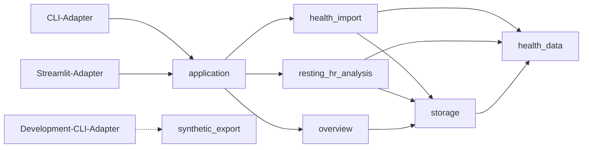

# personal-health-lab
A privacy-first platform for exploring, modeling, and visualizing longitudinal personal health data.

## V0.1-Grundgerüst starten

Voraussetzung ist Python 3.12 oder neuer sowie [`uv`](https://docs.astral.sh/uv/). Ein frischer
Checkout wird mitsamt Entwicklungswerkzeugen so installiert:

```bash
uv sync --locked --all-groups
```

Die leere Übersicht lässt sich im synthetischen Modus über das Production-CLI laden. Synthetische
und reale Daten erhalten bewusst zwei verschiedene Speicherorte:

```bash
uv run healthlab \
  --mode synthetic \
  --synthetic-store "$HOME/.local/share/healthlab/synthetic" \
  --real-store "$HOME/.local/share/healthlab/real" \
  overview
```

Für Automatisierung steht dasselbe Ergebnis als versioniertes JSON bereit:

```bash
uv run healthlab \
  --mode synthetic \
  --synthetic-store "$HOME/.local/share/healthlab/synthetic" \
  --real-store "$HOME/.local/share/healthlab/real" \
  overview --json
```

Streamlit verwendet dieselbe `HealthLab`-Schnittstelle und dieselben Speicherorte:

```bash
HEALTHLAB_MODE=synthetic \
HEALTHLAB_SYNTHETIC_STORE="$HOME/.local/share/healthlab/synthetic" \
HEALTHLAB_REAL_STORE="$HOME/.local/share/healthlab/real" \
uv run streamlit run src/personal_health_lab/adapters/streamlit/app.py
```

Die Qualitätsprüfungen laufen lokal mit:

```bash
uv run ruff check .
uv run mypy
uv run pytest
```

## Dokumentation

- [Architektur und versionierte Roadmap](./HEALTH_ANALYTICS_ARCHITECTURE.md)
- [Fachglossar](./CONTEXT.md)
- [Technisches und betriebliches Glossar](./docs/TECHNICAL_GLOSSARY.md)
- [Architekturentscheidungen](./docs/adr/)

## V0.1-Modulabhängigkeiten



Verbindliche Regeln:

- Adapter hängen vom Anwendungsmodul ab, niemals umgekehrt.
- `health_data` hängt von keinem anderen Projektmodul ab.
- `storage` kennt kanonische Typen, aber keine Analyse- oder UI-Logik.
- Der Development-CLI-Adapter darf `synthetic_export` verwenden; das reale Anwendungsmodul und der reale Datenmodus nicht.
- Neue Abhängigkeiten dürfen keinen Zyklus erzeugen.

## V0.1-Interface

```python
with HealthLab.open(runtime_config) as app:
    app.import_health_export(package_path)
    app.run_resting_hr_analysis(config)
    app.load_overview(selection)
```

CLI, Streamlit und End-to-End-Tests verwenden dasselbe Interface. Import-, Speicher-, Qualitäts- und Analyselogik bleibt in den tiefen internen Modulen.
