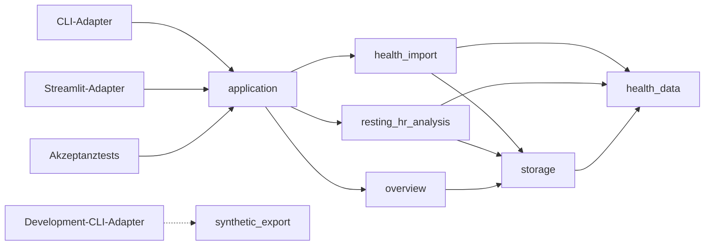

# personal-health-lab
A privacy-first platform for exploring, modeling, and visualizing longitudinal personal health data.

## V0.1 aus einem frischen Checkout nachweisen

Voraussetzung ist Python 3.12 oder neuer sowie [`uv`](https://docs.astral.sh/uv/). Ein frischer
Checkout braucht keine vorbereiteten lokalen Daten. Dieser eine Ablauf installiert die gesperrte
Umgebung und führt die vollständige V0.1-Akzeptanz aus:

```bash
uv sync --locked --all-groups
uv run ruff check .
uv run mypy
uv run pytest
```

Die Suite erzeugt, importiert und analysiert `lag-signal-v1` und `null-v1` ausschließlich in
temporären Datenspeichern. Sie prüft Signal-Recovery samt Unsicherheit, den Null-Guardrail,
idempotenten Reimport, wiederverwendete Analyseläufe, sämtliche feindlichen Import-Fixtures ohne
neuen Snapshot oder Staging-Reste sowie Datenmodus-, Architektur-, Typ- und Adapterverträge. CI
führt dieselben drei Qualitätsbefehle aus.

## V0.1 lokal starten

Die leere Übersicht lässt sich im synthetischen Modus über das Production-CLI laden. Synthetische
und reale Daten erhalten bewusst zwei verschiedene Speicherorte:

```bash
uv run healthlab \
  --mode synthetic \
  --synthetic-store "$HOME/.local/share/healthlab/synthetic" \
  --real-store "$HOME/.local/share/healthlab/real" \
  overview
```

Für Automatisierung steht dasselbe Ergebnis als versioniertes JSON bereit:

```bash
uv run healthlab \
  --mode synthetic \
  --synthetic-store "$HOME/.local/share/healthlab/synthetic" \
  --real-store "$HOME/.local/share/healthlab/real" \
  overview --json
```

Die drei Produktionsbefehle sind `import <export.zip>`, `analyze` und `overview`; jeder
akzeptiert `--json`. Ihre JSON-Ausgaben folgen dem mitinstallierten Schema
`personal_health_lab/adapters/cli/schemas/output-1.0.schema.json`. Effektive Speicherpfade
erscheinen darin ausschließlich als `<redacted>`.

Exit-Code `0` bedeutet Erfolg oder No-op (`duplicate`, `reused`), `3` ein erwartbar
unvollständiges Ergebnis (`rejected`, `quarantined`, `store_busy`, `insufficient_data`,
`unstable`), `2` einen Verwendungs- oder Konfigurationsfehler und `1` einen technischen
Fehler.

Streamlit verwendet dieselbe `HealthLab`-Schnittstelle und dieselben Speicherorte:

```bash
HEALTHLAB_MODE=synthetic \
HEALTHLAB_SYNTHETIC_STORE="$HOME/.local/share/healthlab/synthetic" \
HEALTHLAB_REAL_STORE="$HOME/.local/share/healthlab/real" \
uv run streamlit run src/personal_health_lab/adapters/streamlit/app.py
```

## Reproduzierbare synthetische Health-Exporte

Der getrennte Development-Adapter erzeugt die versionierten Szenarien `lag-signal-v1` und
`null-v1`. Das erste enthält eine dokumentierte negative Lag-1-Assoziation zwischen aktiver
Energie und dem Apple-Ruhepuls des folgenden messlokalen Tages; das zweite enthält kein
eingebautes Verzögerungssignal. Beide Standardexporte decken 365 messlokale Tage ab und enthalten
Fixtures für die Europe/Berlin-Zeitumstellungen sowie Reisen nach America/New_York und Asia/Tokyo.

```bash
uv run healthlab-dev generate \
  --scenario lag-signal-v1 \
  --seed 42 \
  --destination .scratch/lag-signal-v1 \
  --json

uv run healthlab-dev generate \
  --scenario null-v1 \
  --seed 42 \
  --destination .scratch/null-v1 \
  --json
```

Jedes Ziel enthält `apple-health-export.zip`, `scenario-metadata.json` und `checksums.sha256`.
Gleiche Szenarioversion, gleicher Seed und gleiche Optionen erzeugen byte-identische Dateien.
Rauschen und Missingness lassen sich bei Bedarf explizit setzen:

```bash
uv run healthlab-dev generate \
  --scenario lag-signal-v1 \
  --seed 73 \
  --destination .scratch/lag-with-missingness \
  --active-energy-noise-standard-deviation 40 \
  --resting-heart-rate-noise-standard-deviation 0.5 \
  --missing-active-energy-probability 0.05 \
  --missing-resting-heart-rate-probability 0.02
```

Missingness-Wahrscheinlichkeiten müssen kleiner als `1` sein. Der Generator wählt daraus pro
Datentyp und Seed deterministisch `floor(Wahrscheinlichkeit × 365)` fehlende Tage; die tatsächlich
realisierten Anzahlen stehen zusätzlich in den Szenario-Metadaten.

`healthlab-dev` besitzt keine Produktions- oder Real-Store-Konfiguration und verweigert Ziele
innerhalb eines bestehenden HealthLab-Datenspeichers.

## V0.1-Betrieb und Methodik

`healthlab-dev` erzeugt synthetische Pakete; `healthlab` importiert und analysiert sie über dieselbe
`HealthLab`-Schnittstelle wie Streamlit. Der beim Start gebundene Datenmodus bleibt unveränderlich,
und synthetische und reale Daten verwenden physisch getrennte Speicherorte. Imports werden atomar
aus Staging veröffentlicht; identische Pakete liefern `duplicate`, identische erfolgreiche
Analyseläufe `reused`.

Die eingebaute Analysedefinition `lag-signal-v1` modelliert alle sieben Verzögerungen gemeinsam als
regularisiertes lineares Modell. Sie benötigt mindestens 30 vollständige Tage, stuft Ergebnisse ab
180 vollständigen Tagen und akzeptabler Merkmalsabhängigkeit als `robust` ein und verwendet einen
Moving-Block-Bootstrap mit 7-Tage-Blöcken, 250 Resamples, festem Seed und 95%-Intervallen. Angezeigt
werden punktweise Intervalle, ein simultanes Band über das Verzögerungsprofil sowie Schätzungen pro
100 aktive kcal und pro persönliche Standardabweichung. Schließt das simultane Band überall null
ein, verhindert der Guardrail eine stabile Zusammenhangsbehauptung. Das sind Assoziationen, keine
kausalen oder medizinischen Aussagen.

Jeder Lauf speichert Snapshot-, Konfigurations-, Analysedefinitions-, Code- und Environment-Lock-
Identität. Nur eine vollständig identische Reproduktionsidentität darf ein vorhandenes Ergebnis
wiederverwenden.

## Sicherheitsgrenzen für Health-Importe

`RuntimeConfig` begrenzt jedes nicht vertrauenswürdige ZIP vor dem XML-Import. Die versionierten
Standardwerte sind `512 MiB` für Paket-, Eintrags- und gesamte entpackte Größe, `8` Einträge sowie
ein maximales Kompressionsverhältnis von `200`. Sie lassen sich pro Lauf über
`max_import_package_bytes`, `max_import_entries`, `max_import_entry_bytes`,
`max_import_uncompressed_bytes` und `max_import_compression_ratio` verkleinern oder vergrößern.
Größen und Anzahlen müssen positive Ganzzahlen sein; das Verhältnis muss endlich und mindestens
`1` sein. Überschreitungen sowie Traversal, Symlinks, unerwartete Dateien, NUL-/UTF-16-XML, DTDs
und XML-Entitäten werden einheitlich mit `invalid_health_export` abgewiesen.

## Dokumentation

- [Architektur und versionierte Roadmap](./HEALTH_ANALYTICS_ARCHITECTURE.md)
- [Fachglossar](./CONTEXT.md)
- [Technisches und betriebliches Glossar](./docs/TECHNICAL_GLOSSARY.md)
- [Architekturentscheidungen](./docs/adr/)

## V0.1-Modulabhängigkeiten



Verbindliche Regeln:

- Adapter hängen vom Anwendungsmodul ab, niemals umgekehrt.
- `health_data` hängt von keinem anderen Projektmodul ab.
- `storage` kennt kanonische Typen, aber keine Analyse- oder UI-Logik.
- Der Development-CLI-Adapter darf `synthetic_export` verwenden; das reale Anwendungsmodul und der reale Datenmodus nicht.
- Neue Abhängigkeiten dürfen keinen Zyklus erzeugen.

## Anwendungs-Interface

```python
with HealthLab.open(runtime_config) as app:
    request = ImportHealthExport(package_path)
    plan = app.preview_write(request)
    app.execute_write(request, expected_plan=plan.fingerprint)
    app.run_resting_hr_analysis(config)
    app.load_overview(selection)
```

Der erste V0.2-Tracer führt den Import über Schreibvorschau und ausdrückliche Ausführung;
die noch nicht migrierten Analyse- und Leseoperationen bleiben vorläufig auf der V0.1-Seam.
CLI, Streamlit und End-to-End-Tests verwenden dasselbe Interface. Import-, Speicher-,
Qualitäts- und Analyselogik bleibt in den tiefen internen Modulen.
